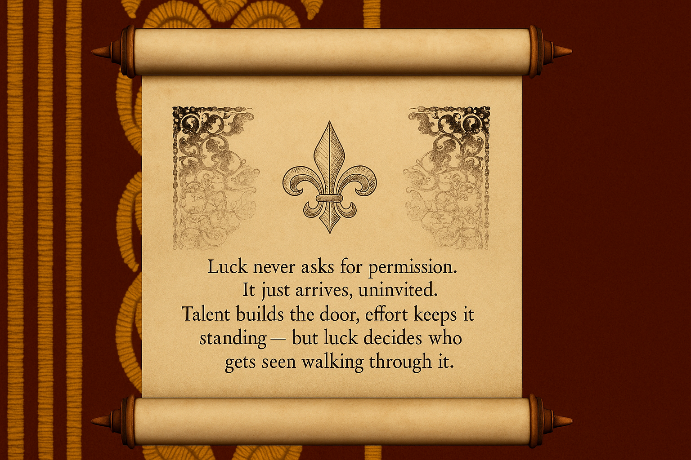

<div align="center">

|   | A | B | C | D | E | F | G | H |
| - | - | - | - | - | - | - | - | - |
| 8 |  |  |  |  |  |  |  |  |
| 7 |  |  |  |  |  |  |  |  |
| 6 |  |  |  |  |  |  |  |  |
| 5 |  |  |  |  |  |  |  |  |
| 4 |  |  |  |  |  |  |  |  |
| 3 |  |  |  |  |  |  |  |  |
| 2 |  |  |  |  |  |  |  |  |
| 1 |  |  |  |  |  |  |  |  |


<div align="center">

```
╔══════════════════════════════════════════════════════════════╗
║                                                              ║
║              ♔ MAHI'S DEVELOPMENT BOARD ♔                    ║
║                                                              ║
║        AI ENGINEERING • FULL STACK • SYSTEMS DESIGN          ║
║                                                              ║
╚══════════════════════════════════════════════════════════════╝
```

</div>

---

<div align="center">

### ♟️ OPENING POSITION

**AI Engineer** • Deep Learning • GPU Optimization • LLM Fine-tuning  
*Building intelligent systems that solve complex problems*

</div>

---

<div align="center">

### ♜ PIECES IN PLAY

</div>

<table align="center">
<tr>
<td align="center" width="20%">
<strong>♛ Backend & AI</strong><br/>
<sub>RAG Systems<br/>LLM Architectures<br/>Django/FastAPI<br/>PostgreSQL</sub>
</td>
<td align="center" width="20%">
<strong>♝ Frontend</strong><br/>
<sub>Vue.js<br/>Responsive Design<br/>UI/UX<br/>Performance</sub>
</td>
<td align="center" width="20%">
<strong>♜ Infrastructure</strong><br/>
<sub>Docker/K8s<br/>Server Management<br/>CI/CD<br/>Database Design</sub>
</td>
<td align="center" width="20%">
<strong>♚ AI Engineering</strong><br/>
<sub>Deep Learning<br/>GPU Optimization<br/>LLM Fine-tuning<br/>Model Deployment</sub>
</td>
<td align="center" width="20%">
<strong>♞ Leadership</strong><br/>
<sub>Project Direction<br/>Team Coordination<br/>Strategic Planning<br/>Communication</sub>
</td>
</tr>
</table>

---

<div align="center">

### MOVES

</div>

```
┌──────────────────────┬──────────────────────┬──────────────────────┐
│    ♟ AI & Agents     │  ♟ Full Stack Dev    │   ♟ Smart Systems    │
├──────────────────────┼──────────────────────┼──────────────────────┤
│ Autonomous agents    │ End-to-end products  │ Intelligent scaling  │
│ that think & execute │ that ship & deliver  │ that adapts & evolves│
│                      │                      │                      │
│ ⚡ LLMs & RAG         │ ⚡ Vue & Django       │ ⚡ Architecture       │
│ ⚡ Automation         │ ⚡ FastAPI & DBs      │ ⚡ DevOps & CI/CD     │
│ ⚡ Prompt Eng         │ ⚡ Modern Frontends   │ ⚡ Cloud & Scale      │
└──────────────────────┴──────────────────────┴──────────────────────┘
```

---

<div align="center">

###  MASTERY LEVELS

</div>

```
♔ Full Stack Development    ██████████ ⭐ Expert
♕ AI & ML Systems           ████████░░ ⚡ Advanced-
♖ DevOps & Infrastructure   █████████░ ⚡ Advanced
♗ Project Leadership        █████████░ ⚡ Advanced
♘ Game Development          ██████░░░░ ◆ Intermediate
♙ Entrepreneurship          ██████░░░░ ◆ Intermediate
```

---

<div align="center">

###  CONNECT & ENGAGE

[](https://www.linkedin.com/in/mehdi-belkaim-848209298/)
[](https://x.com/mehdi_belkaim)

</div>

---


<div align="center">

*"Perfection is achieved, not when there is nothing more to add,*  
*but when there is nothing left to take away."*  
— Antoine de Saint-Exupéry

<br>



<picture>
  <source media="(prefers-color-scheme: dark)" srcset="https://raw.githubusercontent.com/clementpoiret/clementpoiret/snake/github-snake-dark.svg" />
  <source media="(prefers-color-scheme: light)" srcset="https://raw.githubusercontent.com/clementpoiret/clementpoiret/snake/github-snake.svg" />
  
</picture>

</div>


